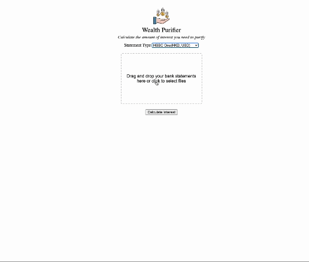

# wealth-purifier
> _The Messenger of Allah, peace and blessings be upon him, said, “A time will surely come upon people in which none will remain but that he consumes usury. If he does not consume it, he will be afflicted by its dust.” - Sunan Abī Dāwūd 3331_

---



Riba has become a ubiquitous part of our modern economic system. The fact that a medium of exchange (money) can itself be commodified has led some like Aristotle to call it "the birth of money from money". 

Instead of having to take investment risks, one has the option of simply sitting back and making money off money itself. In sharp contrast with profit-sharing and risk-sharing models, riba contracts put all the burden on the borrower with little to no downsides to the lender. With how prevalent this has become in this day and age, the best of us find ourselves yet afflicted by its dust. 

With that said, this web app is a humble attempt at brushing off that dust by scraping the interest entries from supported bank statements. 

As someone who likes his zakat calculations to be precise, this application allows me to download the timestamped interest entries in csv format and integrate it with my existing zakat spreadsheets. This lets me know, in a given zakat year, how much of my wealth I need to multiply by 2.5% and how much of it is interest that needs to be given away entirely.

Currently most HK banks don't provide any sort of Open Banking API. Not only that but the list of transactions that can be downloaded in csv format is usually limited to a period of one month. So the only options you have are to either calculate it manually, or to make use of third party services that require you to directly authenticate with your bank account (which requires a degree of trust). So I opted to go down the route of scraping PDF bank statements instead.

PDF scraping/parsing is normally a tricky endeavor but since this application's purpose is very specific, all I had to do was to linear search for sentences matching `INTEREST_REGEX`.

The best solution obviously is to simply move everything to a current account. Whether or not this implies that the banks cannot lend out this amount is unknown however.


## Technology
This project makes use of simple HTML, CSS, JavaScript for the frontend. Backend is a simple serverless function written in Python + Flask and deployed on Vercel.

By default, the hobby plan of Vercel has a serverless function upload size limit of 4.5MB and a timeout of 10s. To get around this limitation, I opted to batch files in groups of 5 and make multiple serverless function calls in parallel.

## Supported bank statements
Application currently supports the following bank statements
- HSBC One(HKD, USD)
- Mox Bank
- HSBC Statement Savings (this is a relatively old bank account which is no longer issued nowadays)

For HSBC One I currently only support HKD and USD. Also you have to download the statements on desktop instead of the HSBC mobile App because the filename format is different. Feel free to create an issue on this repo if you want other foreign currencies supported. Or you could either extend an existing scraper or write your own.

## Adding your own Scraper
This project makes use of scrapers to encapsulate scraping logic for different types of bank statements.

You can write your own scraper if your bank statement type isn't supported.
It has to implement the following interface
```
class Scraper:
  def scrapeInterestEntries(self):
```

`scrapeInterestEntries` should return an array of arrays in the format of `[ ['28 Jul 2021', 0.01], ... ]`
